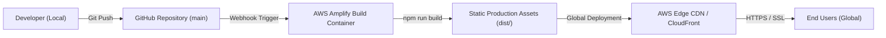

# Serverless Personal Tech Portfolio & Resource Hub


A high-performance, serverless personal developer portfolio and technical documentation hub for **Veysi Can Keten**, focusing on **AI Architectures, Cloud Infrastructure (AWS), and Open-Source Software**. Built from scratch using **Astro v5**, **Tailwind CSS v4**, and **AWS Amplify Hosting**.

---

## 🌟 Overview & Architecture

This repository powers [vyscnktn.com](https://vyscnktn.com). Instead of relying on traditional virtual machine hosting (e.g., EC2 instances) which incurs maintenance overhead and idle server costs, this platform utilizes a **100% Serverless, Static-First Architecture**.



### Key Technical Features

- ⚡ **Zero-JS by Default (Astro Islands):** Ultra-fast page load speeds and zero unnecessary client-side JavaScript overhead.
- 🎨 **Modern Glassmorphism UI & Ambient Lighting:** Customized dark theme featuring background ambient radial glowing orbs, glassmorphism panels (`backdrop-blur`), and Google Fonts (`Plus Jakarta Sans` & `JetBrains Mono`).
- 🌐 **Full Bilingual i18n Support (TR / EN):**
  - Path-based routing (`/` for Turkish, `/en` for English).
  - Language-aware content collection schema filtering.
  - Interactive Navbar language toggle (`TR | EN`).
- 🔄 **Automated CI/CD Pipeline:** Commits pushed to `main` trigger an automated build container in **AWS Amplify**, distributing compiled HTML/CSS assets across AWS's global CDN in seconds.
- 📡 **Automated RSS Feeds & XML Sitemap:**
  - Turkish RSS feed: `/rss.xml`
  - English RSS feed: `/en/rss.xml`
  - Automated Index Sitemap: `/sitemap-index.xml` via `@astrojs/sitemap`.
- 🔍 **SEO & Accessibility (a11y) Best Practices:**
  - Schema.org JSON-LD `Person` & `WebSite` structured metadata.
  - Dynamic canonical and `hreflang` tags.
  - High-contrast `:focus-visible` keyboard navigation focus rings.

---

## 📂 Project Structure

```text
my-site/
├── public/
│   ├── favicon.svg
│   └── robots.txt             # Search engine crawling rules & sitemap pointers
├── src/
│   ├── assets/                # Optimized static assets (profile images)
│   ├── components/
│   │   ├── CopyEmailButton.astro  # Interactive clipboard copy widget + toast
│   │   ├── Footer.astro           # Multi-column footer with social & RSS links
│   │   ├── GuideCard.astro        # Glassmorphism technical guide card
│   │   ├── Hero.astro             # Hero banner with avatar glow & CTAs
│   │   ├── LanguageToggle.astro   # TR / EN language switcher
│   │   ├── Navbar.astro           # Glassmorphism sticky header with status badge
│   │   ├── ProjectCard.astro      # Open-source project card with tech pills
│   │   └── Section.astro          # Reusable section layout wrapper
│   ├── content/
│   │   ├── guides/            # MDX technical guides (tr & en)
│   │   └── projects/          # MDX project showcases (tr & en)
│   ├── i18n/
│   │   └── ui.ts              # Translation dictionary and t() helper
│   ├── layouts/
│   │   └── Layout.astro       # Master layout wrapper with meta tags & JSON-LD
│   ├── pages/
│   │   ├── index.astro        # Turkish homepage (/)
│   │   ├── rss.xml.ts         # Turkish RSS feed generator
│   │   ├── guides/
│   │   │   └── [id].astro     # Dynamic Turkish guide page
│   │   └── en/
│   │       ├── index.astro    # English homepage (/en)
│   │       ├── rss.xml.ts     # English RSS feed generator
│   │       └── guides/
│   │           └── [id].astro # Dynamic English guide page
│   └── styles/
│       └── global.css         # Tailwind v4 import, fonts & glass utilities
├── astro.config.mjs           # Astro configuration (site URL, MDX, Sitemap)
├── content.config.ts          # Astro Content Collections Zod schemas
├── package.json
└── README.md
```

---

## 🛠️ Content Collections Schema

Content collections are strictly validated using Zod schemas inside `src/content.config.ts`:

```typescript
// Projects Schema
const projectsCollection = defineCollection({
  loader: glob({ pattern: '**/*.md', base: './src/content/projects' }),
  schema: z.object({
    title: z.string(),
    description: z.string(),
    techs: z.array(z.string()),
    githubUrl: z.string().url(),
    demoUrl: z.string().url().optional(),
    featured: z.boolean().default(false),
    status: z.string().optional(),
    lang: z.enum(['tr', 'en']).default('tr'),
  }),
});

// Guides Schema
const guidesCollection = defineCollection({
  loader: glob({ pattern: '**/*.md', base: './src/content/guides' }),
  schema: z.object({
    title: z.string(),
    description: z.string(),
    category: z.string(),
    date: z.date(),
    readTime: z.string().default('5 min read'),
    featured: z.boolean().default(false),
    lang: z.enum(['tr', 'en']).default('tr'),
  }),
});
```

---

## 💻 Local Development Setup

### Prerequisites

- **Node.js**: `>=22.12.0`
- **Package Manager**: `npm`

### Installation & Run

1. **Clone the repository:**
   ```bash
   git clone https://github.com/vyscnktn/website.git
   cd website
   ```

2. **Install dependencies:**
   ```bash
   npm install
   ```

3. **Start local development server:**
   ```bash
   npm run dev
   ```
   Open `http://localhost:4321` in your browser.

4. **Build production bundle:**
   ```bash
   npm run build
   ```
   The compiled static website will be output to `./dist/`.

---

## ☁️ Continuous Deployment on AWS Amplify

The deployment process is entirely hands-off once configured:

1. **Repository Connection:** AWS Amplify is connected to the `vyscnktn/website` GitHub repository.
2. **Build Settings (`amplify.yml`):**
   ```yaml
   version: 1
   frontend:
     phases:
       preBuild:
         commands:
           - npm ci
       build:
         commands:
           - npm run build
     artifacts:
       baseDirectory: dist
       files:
         - '**/*'
     cache:
       paths:
         - node_modules/**/*
   ```
3. **Automated Publishing:** Every push to `main` executes `npm run build` inside Amplify's build container and deploys the contents of `dist/` to AWS Edge CDN.

---

## 👤 Author & Social Links

**Veysi Can Keten**  
*Computer Science Student | AI Architect & Cloud Explorer*

- 🌐 **Website:** [vyscnktn.com](https://vyscnktn.com)
- 🐙 **GitHub:** [@vyscnktn](https://github.com/vyscnktn)
- 💼 **LinkedIn:** [Veysi Can Keten](https://linkedin.com/in/veysicanketen)
- 📸 **Instagram:** [@can.yz.anlat](https://www.instagram.com/can.yz.anlat/)

---

## 📄 License

This project is open-source under the [MIT License](LICENSE).
